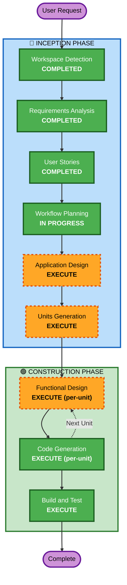

# Execution Plan

## Detailed Analysis Summary

### Change Impact Assessment
- **User-facing changes**: Yes - 고객용 주문 UI + 관리자 대시보드
- **Structural changes**: Yes - 전체 시스템 신규 구축 (React + FastAPI + PostgreSQL)
- **Data model changes**: Yes - 매장, 테이블, 메뉴, 주문, 세션 등 전체 스키마
- **API changes**: Yes - RESTful API + SSE 전체 신규 설계
- **NFR impact**: Yes - 실시간 통신, JWT 인증, 파일 업로드, Docker 배포

### Risk Assessment
- **Risk Level**: Medium
- **Rollback Complexity**: Easy (Greenfield)
- **Testing Complexity**: Moderate (다중 매장, SSE, 파일 업로드)

## Workflow Visualization

## Phases to Execute

### 🔵 INCEPTION PHASE
- [x] Workspace Detection (COMPLETED)
- [x] Reverse Engineering - SKIP (Greenfield)
- [x] Requirements Analysis (COMPLETED)
- [x] User Stories (COMPLETED)
- [x] Workflow Planning (IN PROGRESS)
- [ ] Application Design - EXECUTE
  - **Rationale**: 신규 프로젝트로 컴포넌트 구조, 서비스 레이어, API 설계 필요
- [ ] Units Generation - EXECUTE
  - **Rationale**: 12개 User Story를 구현 가능한 작업 단위로 분해 필요

### 🟢 CONSTRUCTION PHASE
- [ ] Functional Design - EXECUTE (per-unit)
  - **Rationale**: 각 Unit별 상세 비즈니스 로직 및 API 설계 필요
- [ ] NFR Requirements - SKIP
  - **Rationale**: 요구사항에서 NFR 이미 충분히 정의됨 (JWT, bcrypt, SSE)
- [ ] NFR Design - SKIP
  - **Rationale**: NFR 패턴이 단순하여 별도 설계 불필요
- [ ] Infrastructure Design - SKIP
  - **Rationale**: Docker Compose로 단순 구성
- [ ] Code Generation - EXECUTE (per-unit)
  - **Rationale**: 전체 코드 구현
- [ ] Build and Test - EXECUTE
  - **Rationale**: Docker 빌드 및 통합 검증

### 🟡 OPERATIONS PHASE
- [ ] Operations - PLACEHOLDER

## Success Criteria
- **Primary Goal**: 테이블오더 MVP 서비스 완성
- **Key Deliverables**: 고객 주문 UI, 관리자 대시보드, REST API, SSE 실시간 통신, Docker 배포
- **Quality Gates**: Docker Compose로 전체 시스템 기동 및 주문 플로우 동작 확인
